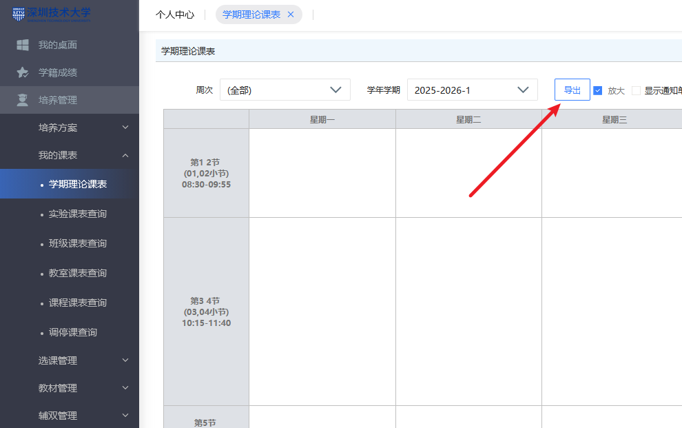
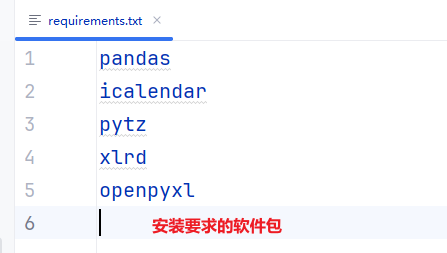
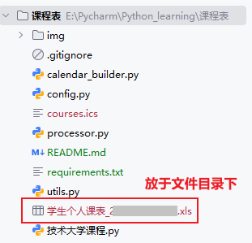
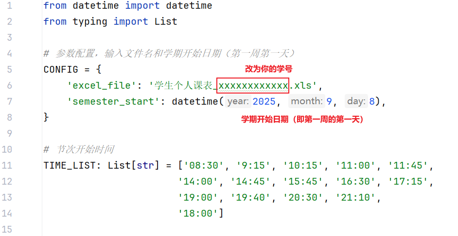
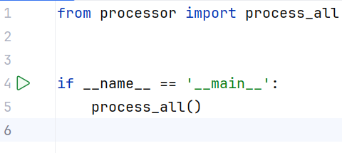
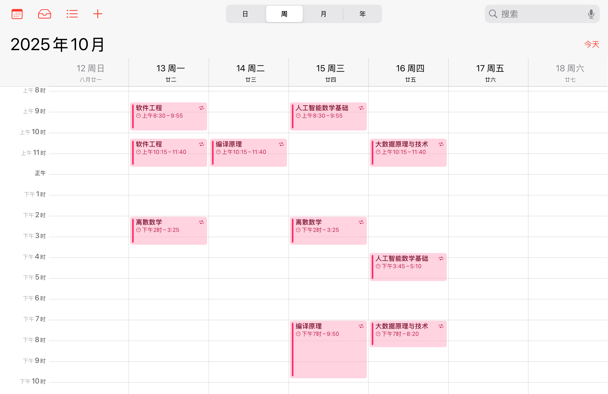

# 将技术大学的课表的.xls文件转换成.ics日历文件
本人有列计划的习惯，但是由于系统日历无法显示课表，只能一个个手动添加。市面上的其他方案要么不够完善，要么收费，无奈之下遂写了这个程序。

这个程序可以将深圳技术大学的学生课表转换成.ics日历文件，方便导入到手机或其他设备的日历中。

（如果教务系统课表有变动，要手动再添加一遍哦＜(´⌯  ̫⌯`)＞）
## 用法（请先确保您的电脑中有python环境）：
### 1.登录教务系统，下载个人课表

### 2.下载项目文件，解压。安装软件包。
在终端使用`pip install -r requirements.txt`来安装运行代码必须的模块

### 3.将课表放于项目文件目录下

### 4.修改'config.py'配置文件，输入学号和学期开始日期

### 5.运行'start.py'

### 6.将生成的'courses.ics'导入到日历中

## 大功告成！ヾ(@^▽^@)ノ
（觉得好用不妨点个star😋。本人代码能力还有待提高，若遇到bug莫责怪o(╥﹏╥)o）